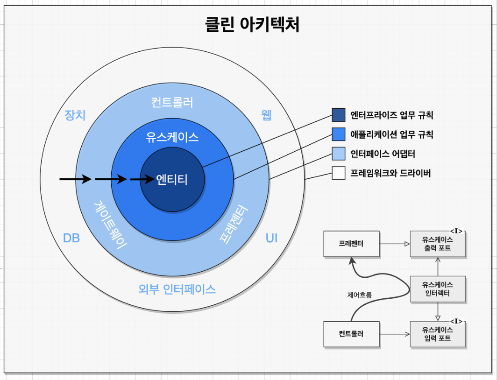
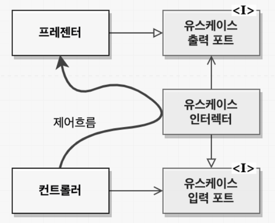

# 22장 클린 아키텍처

육각형 아키텍처, DCI, BCE 등 여러 아키텍처들이 개발되었지만  
목표는 모두 같은 관심사의 분리임.

→ 목표는 소프트웨어를 계층으로 분리함으로써 달성 가능.  
(단, 최소한의 업무 규칙 계층, 사용자와 시스템 인터페이스 계층을 반드시 포함)

아키텍처는 시스템이 다음과 같은 특징을 지니도록 만듦.

프레임워크 독립성 :아키텍처는 프레임워크 존재 여부에 의존하지 않음. 단지 도구로 사용.  
테스트 용이성 : 업무규칙은 세부사항이 결정되지 않아도 또는 없어도 테스트할 수 있음.  
UI 독립성 : 업무 규칙이 UI에 의존하지 않음.  
데이터베이스 독립성 : 업무 규칙은 DB에 의존하지 않음.  
모든 외부 에이전시에 대한 독립성 : 업무 규칙은 외부세계 인터페이스에 대해 알지 못함.  

의존성 규칙
 

클린 아키텍처

안쪽 원으로 갈수록 고수준 소프트웨어가 되며 소스코드 의존성은 반드시 안쪽으로 향해 있어야함.  
내부 원은 외부 원의 함수,클래스, 변수 등 어떠한 것도 알지 못해야함.  
즉, 외부 원이 내부 원에 영향을 주어선 안됨.  

엔티티

엔티티는 전사적인 핵심 업무 규칙을 캡슐화함.  
엔티티 = 핵심 업무 규칙 + 핵심 업무 데이터 OR 메서드만 가진 객체  
운영 관점에서 애플리케이션에 변경이 필요하더라도 엔티티 계층에는 절대 영향을 주어서는 안됨.  

유스케이스  
유스케이스 계층은 애플리케이션에 특화된 업무 규칙을 포함함.  
유스케이스는 엔티티로 들어오고 나가는 흐름을 조정.  
유스케이스 계층에서 발생한 변경이 엔티티 또는 DB, UI, 프레임워크 등 계층에 영향을 주지 않고 격리 되어야 함.  
그러나 운영 관점에서 애플리케이션이 변경되면 유스케이스 계층에도 영향이 감.  

인터페이스 어댑터  
어댑터는 데이터를 유스케이스, 엔티티에게 가장 편리한 형식에서  
DB, 웹 등 외부 에이전시에게 가장 편리한 형식으로 변환됨.  
프레젠터, 뷰, 컨트롤러는 인터페이스 어댑터 계층에 속함.  

프레임워크와 드라이버  
가장 바깥 계층은 일반적으로 DB, 프레임워크 같은 도구 또는 세부사항으로 구성됨.  

원은 네 개여야만 하나?
네개 보다 더 많은 원이 필요할 수도 있지만 그러나 어떤 경우에서든 의존성은 저수준 정책(세부사항)에서 추상화된 고수준 정책으로 향해야 함.  

경계 횡단하기 

우측 하단 다이어그램을 보면 제어 흐름은 컨트롤러에서 유스케이스를 지난 후, 프레젠터로 마무리 됨.  
소스코드 의존성은 유스케이스를 향해 안쪽을 가리킴.  
예를 들면 유스케이스가 프레젠터를 호출해야 할 경우 직접 호출하지 않고 유스케이스 출력 포트 인터페이스를 두어 유스케이스 인터렉트는 이 인터페이스에 의존하고 프레젠터는 이 인터페이스를 구현함으로써 의존성이 역전되게 만들 수 있음.  
이러한 아키텍처 경계를 횡단할 때 동적 다형성을 통해 의존성을 제어흐름과는 반대로 만들 수 있고, 이를 통해 의존성 규칙을 준수할 수 있음.

경계를 횡단하는 데이터는 어떤 모습인가  
간단한 데이터 구조 이거나 구조체 또는 함수 호출 시 인자로 전달될 수 있음.  
뭐가 되었던 간에 이러한 데이터 구조가 의존성 규칙을 위배하게 되는 일은 원치 않으며  
예를 들어 데이터를 행(row)구조 포맷으로 응답 받아서 내부에 전달 할 경우 내부 원에서는 외부 원 DB의 무언가를 알아야 하기 때문에 의존성 규칙이 위배될 수 있음.  
따라서 경계를 가로지르는 데이터는 내부의 원에서 사용하기 편리한 형태를 가져야 함.  

전형적인 시나리오  
모두 의존성 방향이 모두 경계선 안쪽을 향하는 것으로 볼 수 있음.
